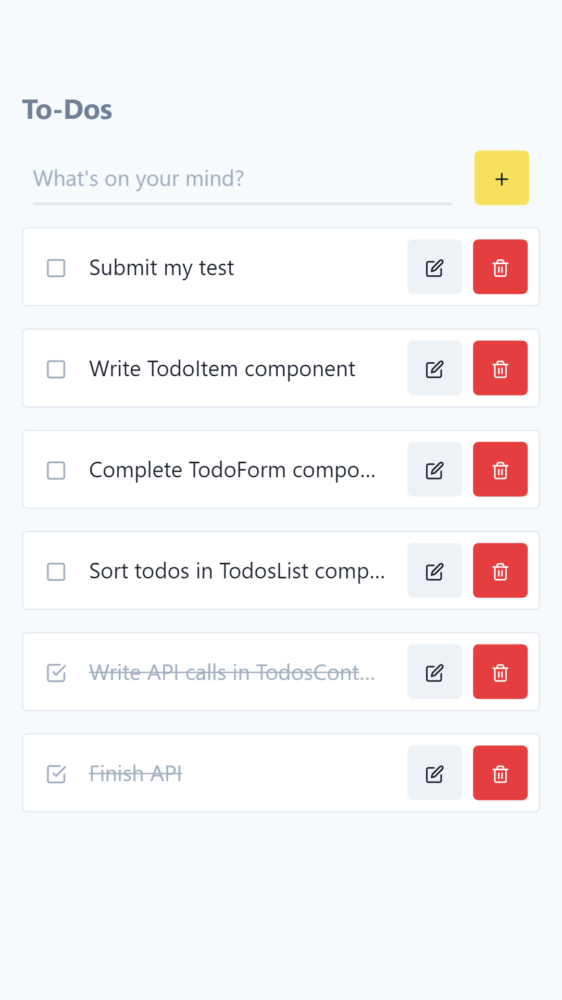
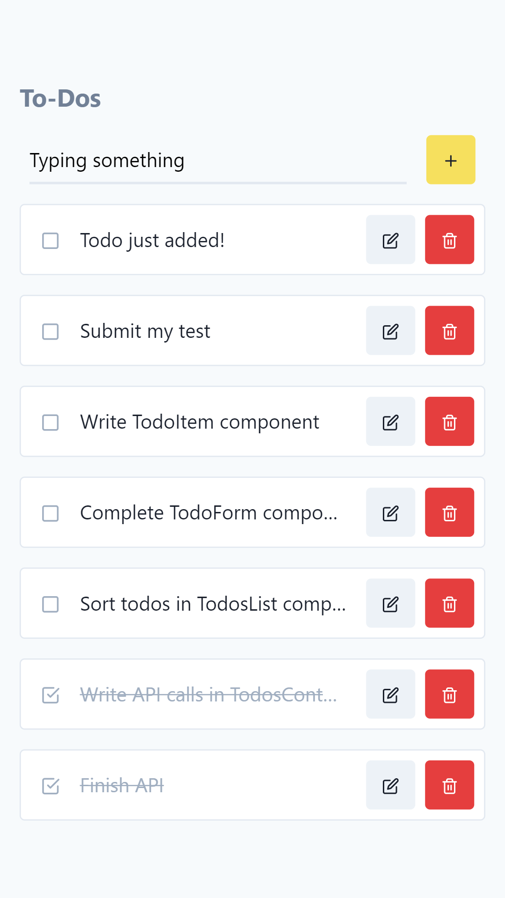
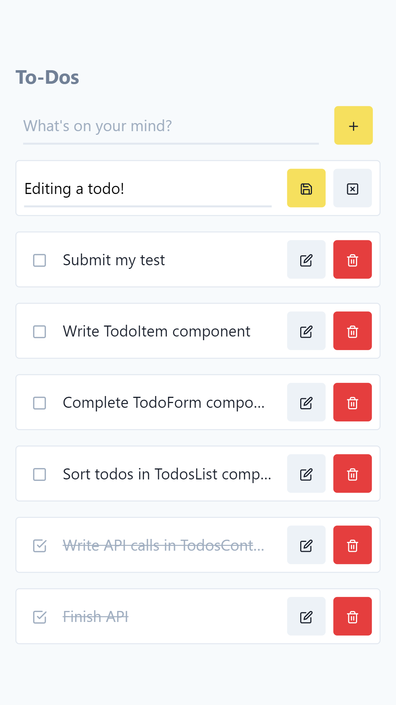

List todos | Add todo | Update todo
---|---|---
 |  | 

And have a look at the [full demo (gif)](./assets/demo.gif).

### Running the project

```
npm run dev
```

Your web-app will be available at [localhost:3000](http://localhost:3000). Changes made to the code should reload automatically.

## 🧰 API reference

<table>
  <thead>
    <tr>
      <th>Endpoint</th>
      <th>Action</th>
      <th>Payload</th>
      <th>Response</th>
    </tr>
  </thead>
  <tbody>
    <tr>
      <td><code>GET /api/todos</code></td>
      <td>Retrieve all todos</td>
      <td><i>(none)</i></td>
      <td>
        <details>
          <summary>See response body</summary>
          <div class="highlight highlight-source-json"><pre>[
  {
    "id": "5f7040a6-d459-4e51-b8f1-223260f06c7b",
    "note": "The todo content!",
    "created_at": 1587405571341,
    "archived": false,
  },
  //...
]</pre></div>
        </details>
      </td>
    </tr>
    <tr>
      <td><code>POST /api/todos</code></td>
      <td>Add todo</td>
      <td><div class="highlight highlight-source-json"><pre>{
  "note": "The todo content!",
}</pre></div></td>
      <td>
        <details>
          <summary>See response body</summary>
          <div class="highlight highlight-source-json"><pre>{
  "id": "5f7040a6-d459-4e51-b8f1-223260f06c7b",
  "note": "The todo content!",
  "created_at": 1587405571341,
  "archived": false,
}</pre></div>
        </details>
      </td>
    </tr>
    <tr>
      <td><code>PUT /api/todos/:id</code></td>
      <td>Update todo</td>
      <td><div class="highlight highlight-source-json"><pre>{
  "note": "The todo content!",
}</pre></div></td>
      <td>
        <details>
          <summary>See response body</summary>
          <div class="highlight highlight-source-json"><pre>{
  "id": "5f7040a6-d459-4e51-b8f1-223260f06c7b",
  "note": "The todo content!",
  "created_at": 1587405571341,
  "archived": false,
}</pre></div>
        </details>
      </td>
    </tr>
    <tr>
      <td><code>POST /api/todos/:id/archive</code></td>
      <td>Archive todo</td>
      <td><i>(none)</i></td>
      <td>
        <details>
          <summary>See response body</summary>
          <div class="highlight highlight-source-json"><pre>{
  "id": "5f7040a6-d459-4e51-b8f1-223260f06c7b",
  "note": "The todo content!",
  "created_at": 1587405571341,
  "archived": true,
}</pre></div>
        </details>
      </td>
    </tr>
    <tr>
      <td><code>POST /api/todos/:id/unarchive</code></td>
      <td>Unarchive todo</td>
      <td><i>(none)</i></td>
      <td>
        <details>
          <summary>See response body</summary>
          <div class="highlight highlight-source-json"><pre>{
  "id": "5f7040a6-d459-4e51-b8f1-223260f06c7b",
  "note": "The todo content!",
  "created_at": 1587405571341,
  "archived": false,
}</pre></div>
        </details>
      </td>
    </tr>
    <tr>
      <td><code>DELETE /api/todos/:id</code></td>
      <td>Delete todo</td>
      <td><i>(none)</i></td>
      <td>
        <details>
          <summary>See response body</summary>
          <div class="highlight highlight-source-json"><pre>{
  "id": "5f7040a6-d459-4e51-b8f1-223260f06c7b",
}</pre></div>
        </details>
      </td>
    </tr>
  </tbody>
</table>

In case of error (invalid ID), the server returns a `404` status code.

---
